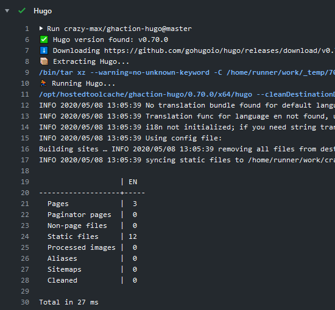

[](https://github.com/crazy-max/ghaction-hugo/releases/latest)
[](https://github.com/marketplace/actions/hugo-github-action)
[](https://github.com/crazy-max/ghaction-hugo/actions?workflow=test)
[](https://codecov.io/gh/crazy-max/ghaction-hugo)
[](https://github.com/sponsors/crazy-max)
[](https://www.paypal.me/crazyws)

## About

GitHub Action for [Hugo](https://gohugo.io/), the world's fastest framework for building websites.

If you are interested, [check out](https://git.io/Je09Y) my other :octocat: GitHub Actions!



___

* [Usage](#usage)
* [Customizing](#customizing)
  * [inputs](#inputs)
* [Contributing](#contributing)
* [License](#license)

## Usage

```yaml
name: hugo

on:
  pull_request:
  push:

jobs:
  hugo:
    runs-on: ubuntu-latest
    steps:
      -
        name: Checkout
        uses: actions/checkout@v3
      -
        name: Run Hugo
        uses: crazy-max/ghaction-hugo@v2
        with:
          version: latest
          extended: false
          args: --cleanDestinationDir --minify --verbose
      -
        name: Deploy to GitHub Pages
        if: success() && github.event_name != 'pull_request'
        uses: crazy-max/ghaction-github-pages@v3
        with:
          target_branch: gh-pages
          build_dir: public
        env:
          GITHUB_TOKEN: ${{ secrets.GITHUB_TOKEN }}
```

## Customizing

### inputs

Following inputs can be used as `step.with` keys

| Name          | Type    | Default   | Description                      |
|---------------|---------|-----------|----------------------------------|
| `version`     | String  | `latest`  | Hugo version. Example: `v0.58.3` |
| `extended`    | Bool    | `false`   | Use Hugo extended                |
| `args`        | String  |           | Arguments to pass to Hugo        |

## Contributing

Want to contribute? Awesome! The most basic way to show your support is to star the project, or to raise issues. If
you want to open a pull request, please read the [contributing guidelines](.github/CONTRIBUTING.md).

You can also support this project by [**becoming a sponsor on GitHub**](https://github.com/sponsors/crazy-max) or by
making a [Paypal donation](https://www.paypal.me/crazyws) to ensure this journey continues indefinitely!

Thanks again for your support, it is much appreciated! :pray:

## License

MIT. See `LICENSE` for more details.
